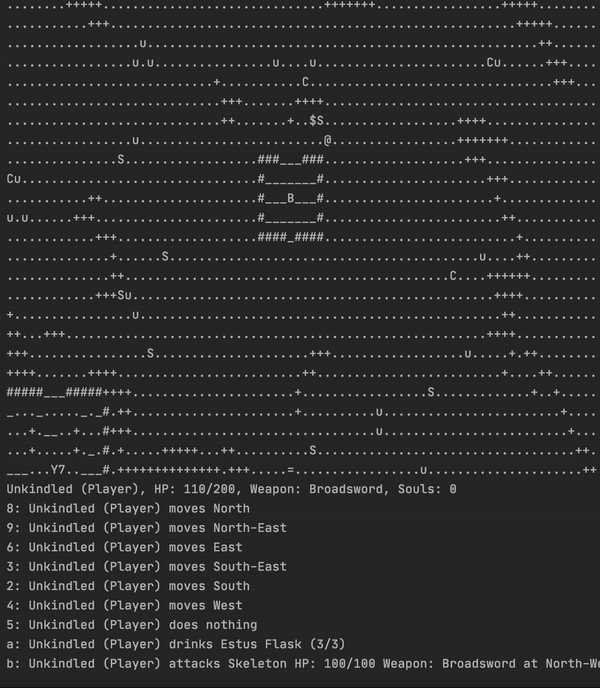

# DesignOSouls
This project is developed for FIT2099 Object Oriented Programming - S2 2021 Monash University. It is a console based rogue-like game inspired by Dark Souls in Java. 
Standard OOP principles and design principles such as SOLID, DRY, etc. are applied to support requirements.

## Collaborators
- Lionie Annabella Wijaya 
- Yeoh Wai Liang

## Documents
Refer to [design document](https://github.com/lioniewijaya/DesignOSouls/blob/master/docs/assignment_design_version1.3.pdf) for extension and other files in [docs](https://github.com/lioniewijaya/DesignOSouls/tree/master/docs) for engine.

## Credit
Game engine is provided by FIT2099 teaching team.
